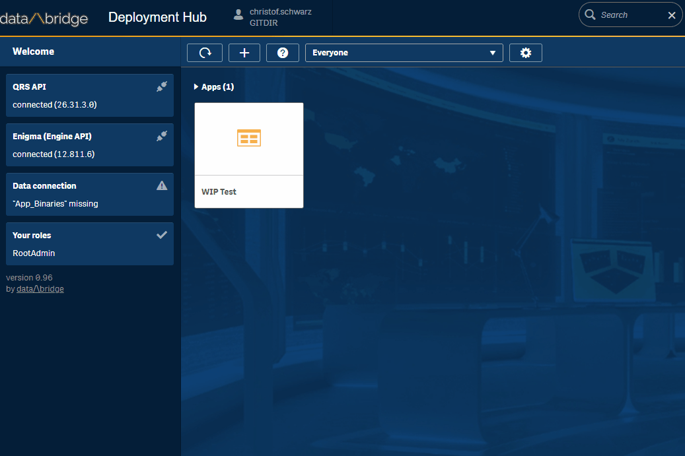

# db_mash_databridgehub
data/\bridge Deployment Hub

The Deployment Hub gives Qlik Sense Developers some highly needed options around app lifecycle:

 - Refresh app from another app or file 
   * all
   * only script
   * only data
   * only design
   * or any combination 
 - Upload app to a stream
 - Rename app
 - Duplicate app
 - Quickly view the datamodel
 - Quickly view the load script

